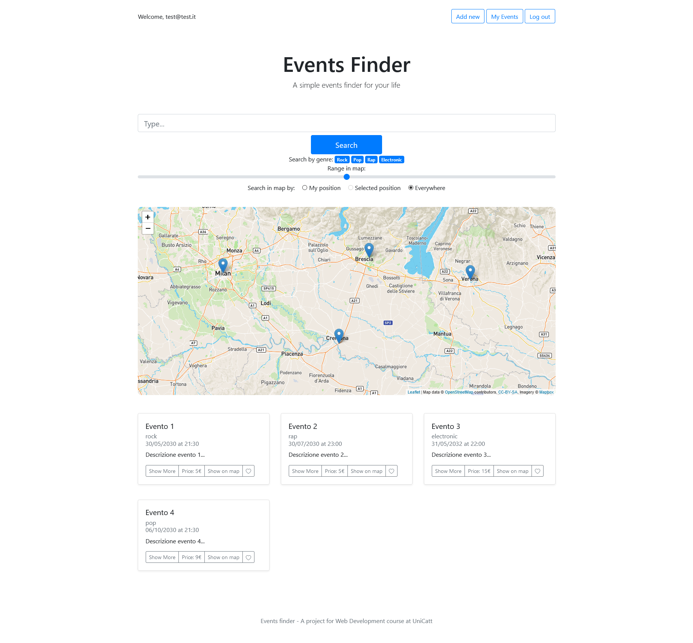
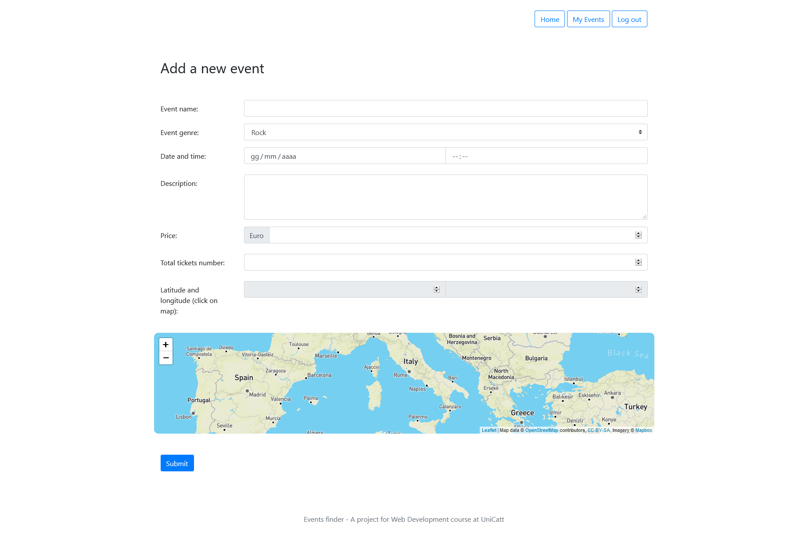

# Events Finder

Applicazione web per la ricerca di eventi musicali realizzata durante il corso di Tecnologie per le Applicazioni Web.  

## Software Stack

 - Node.js
 - Express.js
 - BetterSQLite3
 - JsonWebToken
 - Bootstrap

## Deploy

L'applicazione necessita di un certificato HTTPS da inserire nell'apposita sezione del codice in `app.js`.  
 - `npm install`
 - `npm start`
 - `https://host:3000`

## Struttura del DB

 - `events`: tabella contenente gli eventi e i rispettivi dettagli.  

        CREATE TABLE "events" (
            "id" INTEGER NOT NULL PRIMARY KEY AUTOINCREMENT UNIQUE,
            "eventName" TEXT NOT NULL,
            "eventGenre" TEXT NOT NULL,
            "description" TEXT,
            "lat" NUMERIC NOT NULL,
            "long" NUMERIC NOT NULL,
            "price" NUMERIC,
            "totalTickets" INTEGER NOT NULL,
            "soldTickets" INTEGER,
            "author" INTEGER NOT NULL,
            "date" TEXT NOT NULL,
            "time" TEXT NOT NULL
        )

 - `users`: tabella degli utenti iscritti.

        CREATE TABLE "users" (
	        "id" INTEGER NOT NULL PRIMARY KEY AUTOINCREMENT UNIQUE,
	        "email" TEXT NOT NULL UNIQUE,
	        "name" TEXT NOT NULL,
	        "surname" INTEGER NOT NULL,
	        "password" TEXT NOT NULL,
	        "time" NUMERIC NOT NULL
        )

    Le password vengono cifrate tramite HASH + Salt.

## Funzionalità

 - Visualizzazione degli eventi che ancora devono svolgersi con possibilità di ricerca per nome, genere e posizione.
   
   

 - Aggiunta di nuovi eventi per gli utenti registrati.

   
